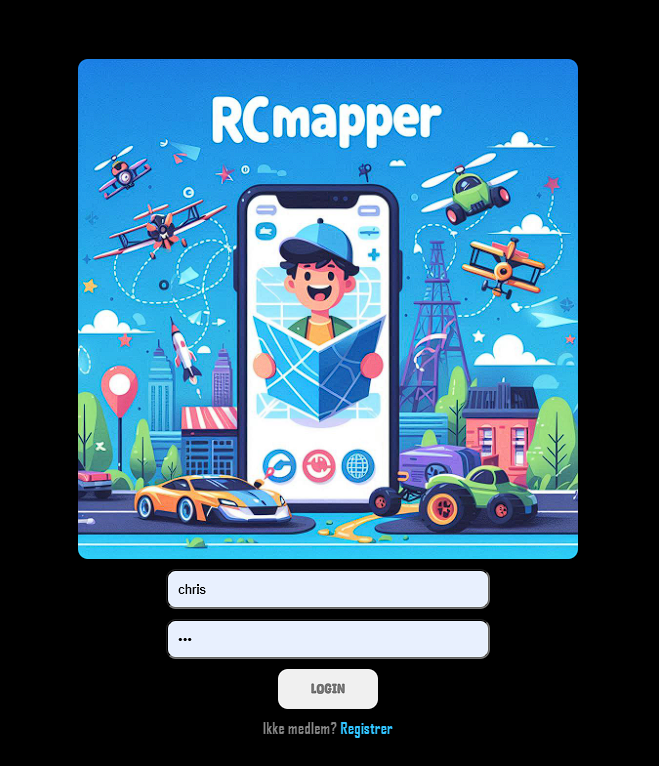
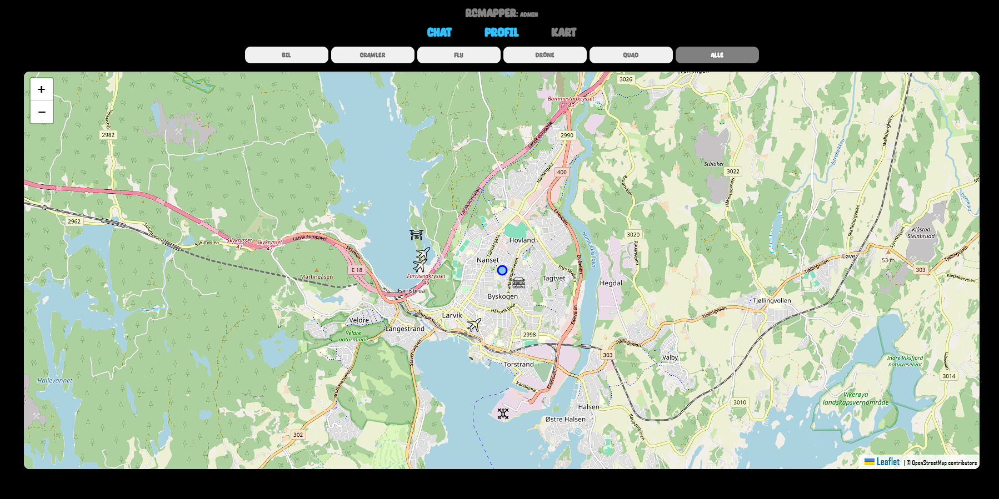
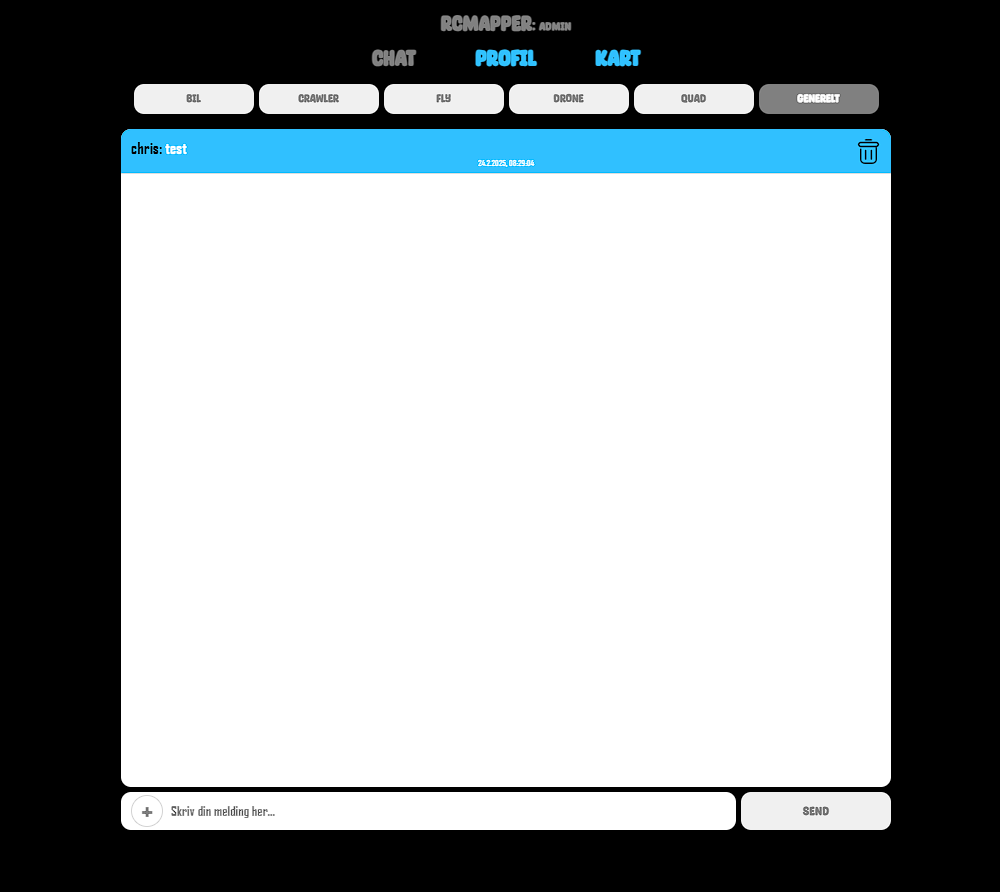
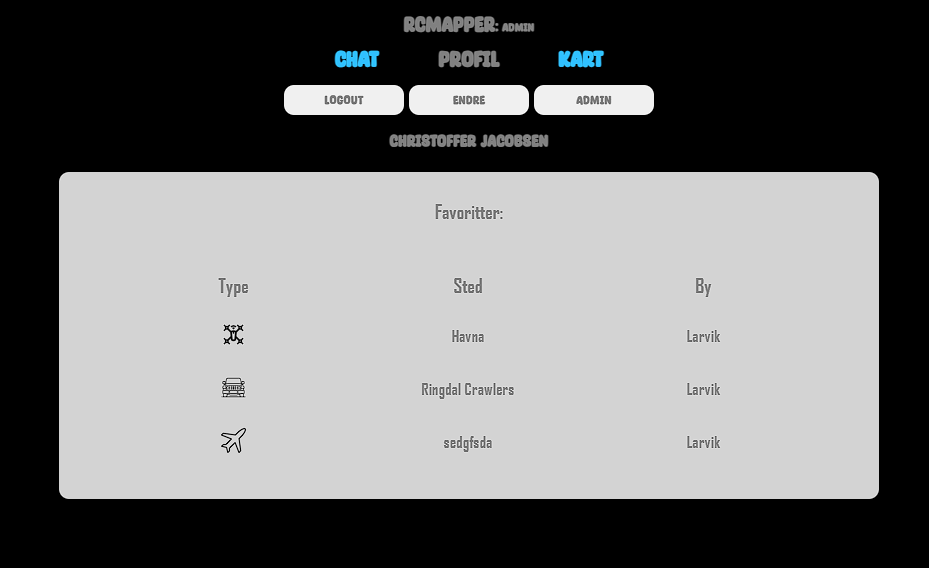

# RcMapper

A full-stack project with an MSSQL database, Node.js backend, and Vue.js frontend. This project is an RC map application with OpenStreetMap integration, user authentication, and user-specific map points to reduce abuse.

---

## Table of Contents
1. [Overview](#overview)
2. [Features](#features)
    - [Registration](#registration)
    - [Login](#login)
    - [Chat](#chat)
    - [Map](#map)
    - [Profile](#profile)
3. [Backend](#backend)
4. [Tools & Dependencies](#tools--dependencies)
5. [Installation](#installation)
6. [Screenshots](#screenshots)

---

## Overview

This project was developed as part of an assignment to create an RC map application using OpenStreetMap. The application allows users to create and save map points, which are tied to their accounts to prevent abuse. The project was built using Node.js for the backend and Vue.js for the frontend, with an MSSQL database for data storage.

As someone new to Node.js and Vue.js, this project was a significant learning experience. Despite the steep learning curve, I was able to complete the project in about four weeks. Along the way, I incorporated various dependencies to simplify development and improve functionality.

---

## Features

### Registration
Users can register by providing their information and selecting a favorite category. The system checks for username and password length, as well as availability. Upon successful registration, the new user is saved to the database.

### Login
This was a bit tricky to get to work correctly, but I added token storage in the browser to save the login information. To make this work, I used JSON web tokens and Vuex to store the login information persistently. The system checks for tokens, and if there is no token or it has expired, it will delete the old token and create a new one. This process is customizable. To log in, users need an account. If they already have one, the system will send a request to the server to check its validity and return the user if it is valid. Otherwise, an error message will be shown. If a user is banned, they cannot log in and will receive an error message. Upon successful login, users will be redirected to the map page, and a token will be generated.

### Chat
The chat feature allows users to sort messages by category. When a category is selected, all messages tagged with that category name are fetched. Users can upload images using Multer, which saves them on the server. Posts can be text, text with an image, or just an image, but they must contain some content. There is a customizable limit on the number of messages, and excess messages are deleted. If there are any images stored on the server associated with the post, they are also deleted. Users can delete any of their own posts and images on the server. Admins can delete any posts if they are offensive or for other reasons. Inside the profile, users can change their favorite chat category so that it starts in their favorite category.

### Map
The map feature was the most work-intensive part of the project. I used OpenStreetMap with Leaflet, which was well-documented and relatively easy to import into Vue. However, converting files and functions from plain JavaScript to Vue posed some challenges. Initially, I used `navigator.geolocation` built into Vue to plot my location on the map.

- I added `map.on`, essentially an event listener inside Leaflet, allowing the creation of new locations saved in the database. Users need to provide the name of the place, a description, and the category.
- Buttons for selecting categories were added. The map fetches locations with new icons based on the category name and puts them in a new layer. Each time the map is refreshed, it deletes the old layer and adds a new one. Each icon is clickable and provides options such as viewing details or deleting the location. Users can delete their own locations, and admins can delete any location.
- Clicking on details reveals information about the place with a locked, disabled map centered on the location. The rating system allows users to rate the place from 1 to 5 stars. Users can rate a place only once. A favorite button adds the location to the user's favorites. It checks if the location is a favorite and displays it accordingly. There is also weather information for the next hour using OpenWeatherMap API with the location coordinates.

### Profile
- The profile has a logout button that deletes the token stored in the browser and redirects the user to the login page.
- A button to change user information like name and other details. Users can also change their favorite chat category. Updating user information also updates the login token with new values.
- Admins have an additional button to manage other users. They can ban, delete, or set admin status for users. There is a search function that updates the user list based on the search. Information is displayed showing if a user is banned or an admin.
- A favorite list for saved locations allows users to click and view details of that location. The `Leaflet GeoCoder` was used to fetch the city's location.

---

## Backend
The backend is built with Node.js and uses the following setup:
- **Server**: Runs in Rider with auto-refresh using `node --watch server.js`.
- **Database**: MSSQL with Sequelize for simplified queries.
- **Security**: HTTPS server with CORS and API keys stored in a `.env` file.
- **Logging**: Morgan for detailed error and status code logging in development mode.
- **Token Management**: JWT and Vuex for user token storage and retrieval.

---

## Tools & Dependencies
- **Database**: [Sequelize](https://www.npmjs.com/package/sequelize)
- **HTTP Requests**: [Axios](https://www.npmjs.com/package/axios)
- **CORS**: [CORS](https://www.npmjs.com/package/cors)
- **Server Framework**: [Express](https://www.npmjs.com/package/express)
- **Environment Variables**: [dotenv](https://www.npmjs.com/package/dotenv)
- **State Management**: [Vuex](https://www.npmjs.com/package/vuex)
- **Authentication**: [JsonWebToken](https://www.npmjs.com/package/jsonwebtoken)
- **File Uploads**: [Multer](https://www.npmjs.com/package/multer)
- **Logging**: [Morgan](https://www.npmjs.com/package/morgan)
- **Geocoding**: [Leaflet Control Geocoder](https://www.npmjs.com/package/leaflet-control-geocoder)
- **Weather API**: [OpenWeatherMap](https://openweathermap.org/)
- **Weather Icons**: [Open Weather Icons](https://github.com/isneezy/open-weather-icons)

---

## Installation
1. Clone the repository:
   ```bash
   git clone https://github.com/chrissundal/RcMapper-fullstack.git

## Screenshots





